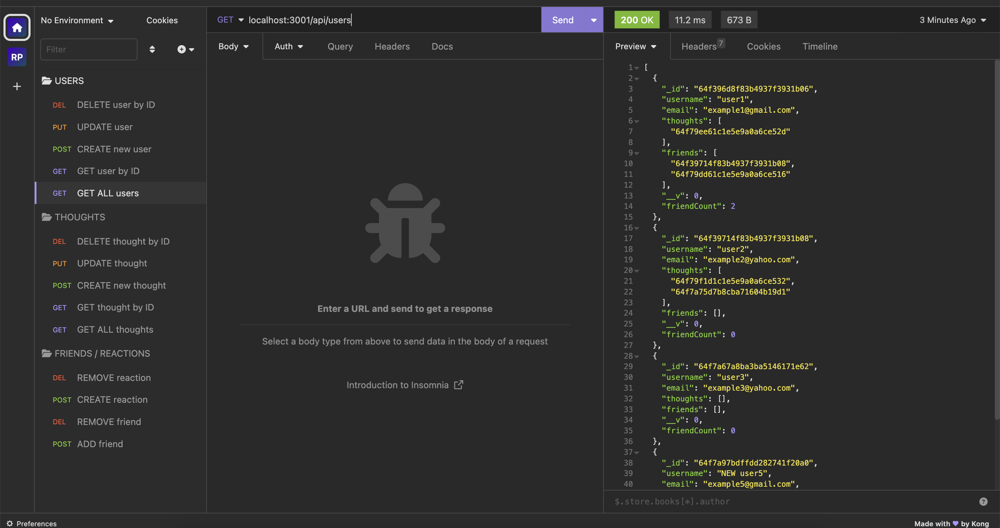

# NoSQL: Social Network API (Module 18 Challenge)

## Description

Our challenge this week was to build an API for a social network web application where users can share their thoughts, react to friends' thoughts, and create a friend list. I used `Express.js` for routing, a `MongoDB` database, and the `Mongoose ODM` package. I also used the `Moment.js` library for date handling to format timestamps. I've created a great base for the backend of a social media application in order to handle large amounts of data and flexibility with unstructured data using `MongoDB`, which is a `NoSQL` database manager.

## Table of Contents

- [User Story](#user-story)
- [Acceptance Criteria](#acceptance-criteria)
- [Installation](#installation)
- [Usage](#usage)
- [Credits](#credits)
- [License](#license)

## User Story

AS A social media startup  
I WANT an API for my social network that uses a NoSQL database  
SO THAT my website can handle large amounts of unstructured data  

## Acceptance Criteria

GIVEN a social network API  
WHEN I enter the command to invoke the application  
THEN my server is started and the Mongoose models are synced to the MongoDB database  
WHEN I open API GET routes in Insomnia for users and thoughts  
THEN the data for each of these routes is displayed in a formatted JSON  
WHEN I test API POST, PUT, and DELETE routes in Insomnia  
THEN I am able to successfully create, update, and delete users and thoughts in my database  
WHEN I test API POST and DELETE routes in Insomnia  
THEN I am able to successfully create and delete reactions to thoughts and add and remove friends to a user’s friend list  

## Installation

- In your CLI, run the command `npm install` to install all your dependencies and packages to use this backend social media API.  

## Usage

- In your CLI, run the command `node server.js` to start your server. You can now interact with your database in Insomnia. See video and screenshots below:  

Watch the walkthrough tutorial video here: https://drive.google.com/file/d/10YjP-nYZSdzPzUtMp4ox9CEmUEA1qYkQ/view    

  
  
  
  

## Credits

AskBCS - helped with pushing new thoughts to the user's data.

## Features

- GET all users
- GET a single user by ID  
- POST a new user
- PUT (update) user by ID
- DELETE user by ID, remove associated thoughts
- POST to add a new friend to a user's friend list
- DELETE to remove a friend
- GET all thoughts
- GET a single thought by ID
- POST a new thought and push to associated user's thoughts array field
- PUT (update) a thought by ID
- DELETE thought by ID
- POST to create reaction and add to associated thought's reactions array field
- DELETE to remove reaction by ID